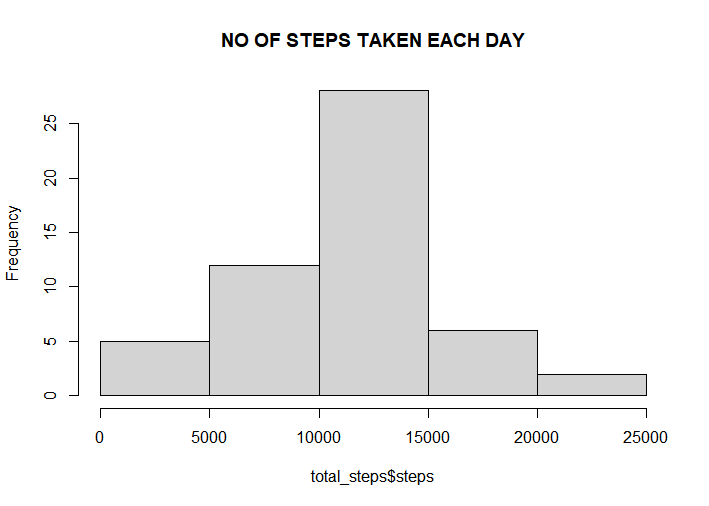
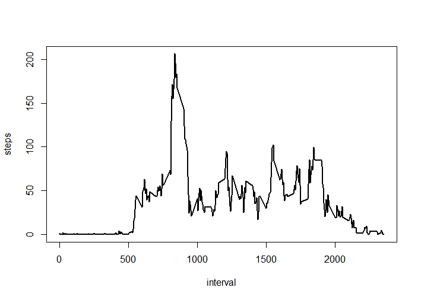
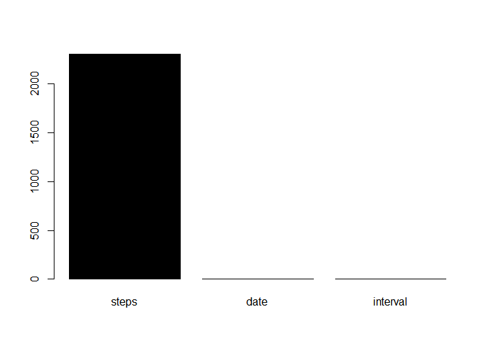
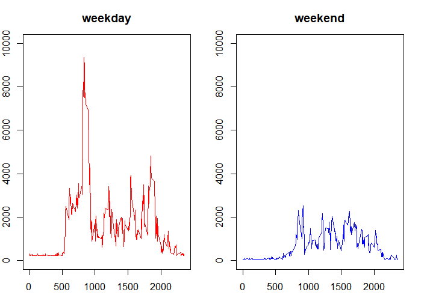

Reproducible Research: Peer Assessment
======================================

Introduction
------------

It is now possible to collect a large amount of data about personal
movement using activity monitoring devices such as a Fitbit, Nike
Fuelband, or Jawbone Up. These type of devices are part of the
“quantified self” movement – a group of enthusiasts who take
measurements about themselves regularly to improve their health, to find
patterns in their behavior, or because they are tech geeks. But these
data remain under-utilized both because the raw data are hard to obtain
and there is a lack of statistical methods and software for processing
and interpreting the data.

This assignment makes use of data from a personal activity monitoring
device. This device collects data at 5 minute intervals through out the
day. The data consists of two months of data from an anonymous
individual collected during the months of October and November, 2012 and
include the number of steps taken in 5 minute intervals each day.

The data for this assignment can be downloaded from the course web site:

The variables included in this dataset are:

**steps** : Number of steps taking in a 5-minute interval (missing
values are coded as NA)

**date** : The date on which the measurement was taken in YYYY-MM-DD
format

**interval** : Identifier for the 5-minute interval in which measurement
was taken

The dataset is stored in a comma-separated-value (CSV) file and there
are a total of 17,568 observations in this dataset

Repo
----

1.  Valid GitHub URL
2.  At least one commit beyond the original fork
3.  Valid SHA-1
4.  SHA-1 corresponds to a specific commit

Commit containing full submission
---------------------------------

1.  Code for reading in the dataset and/or processing the data
2.  Histogram of the total number of steps taken each day
3.  Mean and median number of steps taken each day
4.  Time series plot of the average number of steps taken
5.  The 5-minute interval that, on average, contains the maximum number
    of steps
6.  Code to describe and show a strategy for imputing missing data
7.  Histogram of the total number of steps taken each day after missing
    values are imputed
8.  Panel plot comparing the average number of steps taken per 5-minute
    interval across weekdays and weekends
9.  All of the R code needed to reproduce the results (numbers, plots,
    etc.) in the report

Assignment
----------

This assignment will be described in multiple parts. You will need to
write a report that answers the questions detailed below. Ultimately,
you will need to complete the entire assignment in a single R markdown
document that can be processed by knitr and be transformed into an HTML
file.

Throughout your report make sure you always include the code that you
used to generate the output you present. When writing code chunks in the
R markdown document, always use echo = TRUE so that someone else will be
able to read the code. This assignment will be evaluated via peer
assessment so it is essential that your peer evaluators be able to
review the code for your analysis.

For the plotting aspects of this assignment, feel free to use any
plotting system in R (i.e., base, lattice, ggplot2)

Fork/clone the GitHub repository created for this assignment. You will
submit this assignment by pushing your completed files into your forked
repository on GitHub. The assignment submission will consist of the URL
to your GitHub repository and the SHA-1 commit ID for your repository
state.

NOTE: The GitHub repository also contains the dataset for the assignment
so you do not have to download the data separately.

Loading and preprocessing the data
----------------------------------

1.  Load the data (i.e. read.csv())
2.  Process/transform the data (if necessary) into a format suitable for
    your analysis

<!-- -->

    library(dplyr)

    ## 
    ## Attaching package: 'dplyr'

    ## The following objects are masked from 'package:stats':
    ## 
    ##     filter, lag

    ## The following objects are masked from 'package:base':
    ## 
    ##     intersect, setdiff, setequal, union

    library(tidyr)

    data = read.csv("activity.csv")
    str(data)

    ## 'data.frame':    17568 obs. of  3 variables:
    ##  $ steps   : int  NA NA NA NA NA NA NA NA NA NA ...
    ##  $ date    : chr  "2012-10-01" "2012-10-01" "2012-10-01" "2012-10-01" ...
    ##  $ interval: int  0 5 10 15 20 25 30 35 40 45 ...

    data$date = as.Date(data$date, "%Y-%m-%d")

What is mean total number of steps taken per day?
-------------------------------------------------

For this part of the assignment, you can ignore the missing values in
the dataset.

1.  Calculate the total number of steps taken per day
2.  If you do not understand the difference between a histogram and a
    barplot, research the difference between them. Make a histogram of
    the total number of steps taken each day
3.  Calculate and report the mean and median of the total number of
    steps taken per day

<!-- -->

    total_steps <- aggregate(steps ~ date, data = data, sum)
    hist(total_steps$steps, main = "NO OF STEPS TAKEN EACH DAY")

    meandata = mean(total_steps$steps)
    meandata

    ## [1] 10766.19

    mediandata = median(total_steps$steps)
    mediandata

    ## [1] 10765

What is the average daily activity pattern?
-------------------------------------------

1.  Make a time series plot (i.e. type = “l”) of the 5-minute interval
    (x-axis) and the average number of steps taken, averaged across all
    days (y-axis)
2.  Which 5-minute interval, on average across all the days in the
    dataset, contains the maximum number of steps?

<!-- -->

    meanstepinterval = aggregate(steps ~ interval  , data = data, mean)
    plot(steps ~ interval, data = meanstepinterval, type = "l", lwd = 2)

    maxstep = meanstepinterval %>%
        filter(steps == max(meanstepinterval$steps))

    maxstep

    ##   interval    steps
    ## 1      835 206.1698

Imputing missing values
-----------------------

Note that there are a number of days/intervals where there are missing
values (coded as NA). The presence of missing days may introduce bias
into some calculations or summaries of the data.

1.  Calculate and report the total number of missing values in the
    dataset (i.e. the total number of rows with NAs)
2.  Devise a strategy for filling in all of the missing values in the
    dataset. The strategy does not need to be sophisticated. For
    example, you could use the mean/median for that day, or the mean for
    that 5-minute interval, etc.
3.  Create a new dataset that is equal to the original dataset but with
    the missing data filled in.
4.  Make a histogram of the total number of steps taken each day and
    Calculate and report the mean and median total number of steps taken
    per day. Do these values differ from the estimates from the first
    part of the assignment? What is the impact of imputing missing data
    on the estimates of the total daily number of steps?

<!-- -->

    sum(is.na(data))

    ## [1] 2304

    barplot(is.na(data))

    mean_steps = mean(meanstepinterval$steps)
    new_data = data %>%
        mutate(steps = ifelse(is.na(steps), mean_steps, steps))

    total_steps2 =  aggregate(steps ~ date, new_data, sum)
    hist(total_steps2$steps, main = "Histogram of total number of steps taken per day", xlab = "Total number of steps")

    summary(total_steps)

    ##       date                steps      
    ##  Min.   :2012-10-02   Min.   :   41  
    ##  1st Qu.:2012-10-16   1st Qu.: 8841  
    ##  Median :2012-10-29   Median :10765  
    ##  Mean   :2012-10-30   Mean   :10766  
    ##  3rd Qu.:2012-11-16   3rd Qu.:13294  
    ##  Max.   :2012-11-29   Max.   :21194

    summary(total_steps2)

    ##       date                steps      
    ##  Min.   :2012-10-01   Min.   :   41  
    ##  1st Qu.:2012-10-16   1st Qu.: 9819  
    ##  Median :2012-10-31   Median :10766  
    ##  Mean   :2012-10-31   Mean   :10766  
    ##  3rd Qu.:2012-11-15   3rd Qu.:12811  
    ##  Max.   :2012-11-30   Max.   :21194

Are there differences in activity patterns between weekdays and weekends?
-------------------------------------------------------------------------

For this part the weekdays() function may be of some help here. Use the
dataset with the filled-in missing values for this part.

1.  Create a new factor variable in the dataset with two levels –
    “weekday” and “weekend” indicating whether a given date is a weekday
    or weekend day.
2.  Make a panel plot containing a time series plot (i.e. type = “l”) of
    the 5-minute interval (x-axis) and the average number of steps
    taken, averaged across all weekday days or weekend days (y-axis).
    See the README file in the GitHub repository to see an example of
    what this plot should look like using simulated data.

<!-- -->

    check_data = weekdays(new_data$date)

    weekday_data = new_data %>%
        mutate(days = ifelse(weekdays(date) == "Saturday" | weekdays(date) == "Sunday", "weekend", "weekday"))

    weekday_step = weekday_data %>%
        group_by(days, interval) %>%
        summarise(steps = sum(steps))

    ## `summarise()` regrouping output by 'days' (override with `.groups` argument)

    weekday = weekday_data %>%
        group_by(days, interval) %>%
        filter(days == "weekday") %>%
        summarise(steps = sum(steps))

    ## `summarise()` regrouping output by 'days' (override with `.groups` argument)

    weekend = weekday_data %>%
        group_by(days, interval) %>%
        filter(days == "weekend") %>%
        summarise(steps = sum(steps))

    ## `summarise()` regrouping output by 'days' (override with `.groups` argument)

    par(mfrow=c(1,2))
    par(mar = c(3, 2, 3, 2))
    plot(steps ~ interval, data = weekday, type = "l", lwd = 1, main = "weekday", col = "red", ylim = (c(0,10000)))
    plot(steps ~ interval, data = weekend, type = "l", lwd = 1,  main = "weekend", col = "blue", ylim = (c(0,10000)))

